# the engine

OATH's generation engine is a 10-stage pipeline. it produces a personalized 45-90 second audio ritual from 5 user inputs via 8 claude calls and 1 elevenlabs synthesis, end-to-end in 20-30 seconds.

this doc explains every stage. for a real run with every stage's input and output captured as json, see [experiments/04-multi-pass-refinement/](../experiments/04-multi-pass-refinement/). for v1 vs v2 audio side-by-side, see [experiments/05-v2-vs-v1-comparison/](../experiments/05-v2-vs-v1-comparison/).

## why 10 stages

v1 was a single claude call + a single elevenlabs call. it works. but a single-shot llm pipeline has no internal selection pressure, no traceability, and no way to catch its own mistakes. v2 splits the work into stages with distinct responsibilities so:

- **multi-candidate generation guards against bad rolls.** stage 2 generates 3 candidates at different temperatures. stage 4 picks the best on a 6-axis rubric. the worst v2 run looks like the median v1 run.
- **critique catches what the model misses about itself.** stage 3's separate critique pass with structured scoring frequently disagrees with the model's self-reported confidence from stage 2.
- **per-stage trace is debuggable.** every stage writes its input and output. when a generation drifts in production, the trace tells you which stage drifted.
- **mode-tuned synthesis is possible.** stages 7 and 8 apply mode-specific prosody and voice settings — hardest_work gets long, grounded pauses; gym_now gets short, kinetic ones; grounding_phrases gets long liturgical ones.

cost: ~$0.13/ritual vs v1's ~$0.07. latency: 20-30s vs ~10s. ROI: bounded worst case + traceability.

## the pipeline

```mermaid
flowchart TD
    Start([User Inputs:<br/>mode, intent, first_action, hero, phrase]) --> S0[Stage 0: Validate<br/>Pure logic]
    S0 --> S1[Stage 1: Analyze & Plan<br/>Claude call 1]
    S1 --> S2[Stage 2: Generate 3 Candidates<br/>Claude calls 2-4 in parallel<br/>temps 0.6, 0.8, 1.0]
    S2 --> S3[Stage 3: Critique Each<br/>Claude calls 5-7 in parallel<br/>6-axis rubric]
    S3 --> S4[Stage 4: Select Winner<br/>Pure logic, weighted scoring]
    S4 --> Threshold{Passes<br/>thresholds?<br/>overall ≥ 7.0<br/>no axis < 5.0}
    Threshold -->|Yes| S6
    Threshold -->|No| S5[Stage 5: Refine<br/>Claude call 8<br/>critique injected as feedback]
    S5 --> S6[Stage 6: Judge<br/>Claude call 9 if no refine, 8 if refine<br/>holistic 1-10 + get_out_of_bed]
    S6 --> S7[Stage 7: Prosody Markup<br/>Pure logic<br/>insert mode-tuned break tags]
    S7 --> S8[Stage 8: Synthesize<br/>ElevenLabs call<br/>mode-tuned voice settings]
    S8 --> S9[Stage 9: Music Bed<br/>v1.1 stub, pass-through]
    S9 --> S10[Stage 10: Assemble<br/>+ Full trace JSON]
    S10 --> End([Final MP3 + pipeline_run.json])

    style S1 fill:#1a1d26,stroke:#f59e0b
    style S2 fill:#1a1d26,stroke:#f59e0b
    style S3 fill:#1a1d26,stroke:#f59e0b
    style S5 fill:#1a1d26,stroke:#f59e0b
    style S6 fill:#1a1d26,stroke:#f59e0b
    style S8 fill:#1a1d26,stroke:#10b981
    style S9 fill:#1a1d26,stroke:#6366f1,stroke-dasharray: 5 5
```

## the stages, in detail

### stage 0 — validate

[`pipeline/v2/stage_0_validate.py`](../pipeline/v2/stage_0_validate.py)

pure python. confirms `mode`, `variant`, and `voice` are in their allowed sets. strips whitespace. enforces length limits (intent ≤ 100 chars, first_action ≤ 80, hero ≤ 60, phrase ≤ 120). normalizes capitalization on the hero name.

raises `ValueError` with a specific message on any violation.

### stage 1 — analyze & plan

[`pipeline/v2/stage_1_analyze.py`](../pipeline/v2/stage_1_analyze.py)

1 claude call (sonnet 4.6, temp 0.4). claude reads the user's inputs and produces a structured plan **before any script is written**:

- `tone_notes` — the precise tone for this specific user (not the generic mode tone)
- `hero_anchor_strategy` — which specific habit / time / moment of this hero maps to the intent
- `grounding_phrase_placement` — where in the arc the phrase lands
- `command_structure` — the form of the closing command
- `estimated_complexity` — low / medium / high

the plan is injected into stage 2's user prompt so all 3 candidates aim at the same target.

### stage 2 — generate 3 candidates (parallel)

[`pipeline/v2/stage_2_generate.py`](../pipeline/v2/stage_2_generate.py)

3 claude calls (sonnet 4.6, temps **0.6 / 0.8 / 1.0**) via `asyncio.gather()`. all 3 finish in ~5-8 seconds total.

each candidate uses the v1 3-layer prompt structure (identity + mode + variant) **plus** a few-shot example for the mode (winning script from prompt 2's monday-night experiment, with annotation explaining what makes it strong) **plus** the structural plan from stage 1.

each candidate outputs JSON with `script`, `estimated_duration_seconds`, and `internal_self_check` (model's confidence 1-10 that it hit the arc).

### stage 3 — critique against 6-axis rubric (parallel)

[`pipeline/v2/stage_3_critique.py`](../pipeline/v2/stage_3_critique.py) + [`pipeline/v2/rubric.py`](../pipeline/v2/rubric.py)

3 claude calls (sonnet 4.6, temp 0.2) in parallel. each evaluates one candidate against:

| axis | weight | description |
|---|---|---|
| specificity | 2.0 | quotes user's intent verbatim or near-verbatim |
| command_density | 1.5 | ratio of imperatives to descriptive sentences |
| structural_arc_completeness | 1.5 | hits all 5 beats |
| cliche_freedom | 1.0 | absence of subtle motivational clichés |
| hero_anchor_concreteness | 1.5 | specific habit / time / place, not platitude |
| voice_directness | 1.0 | declaratives over questions/hedges |

each axis scored 1-10 against anchor descriptions. weighted average gives the overall score. weakest axis identified, critique notes generated.

the critique pass frequently disagrees with the candidate's `internal_self_check`. on our reference run, candidate 2 self-checked at 9 but got 8.41 from critique — a real catch.

### stage 4 — select winner (pure logic)

[`pipeline/v2/stage_4_select.py`](../pipeline/v2/stage_4_select.py)

no claude call. selection rule:
1. filter candidates that pass thresholds (overall ≥ 7.0, all axes ≥ 5.0)
2. if any pass: pick highest overall_score
3. if none pass: pick closest-to-passing, flag `refinement_needed = true`

### stage 5 — refine (conditional)

[`pipeline/v2/stage_5_refine.py`](../pipeline/v2/stage_5_refine.py)

runs only if no candidate passed the thresholds. 1 claude call (sonnet 4.6, temp 0.5) with the critique injected as feedback:

> "the previous attempt scored {overall}/10. weakest axis: {weakest_axis} ({score}/10). critique: {notes}. regenerate with attention to fixing the weakest axis while preserving the other strengths."

on our reference run this stage was skipped (winner candidate 3 passed at 9.41/10). when it runs, it adds ~3-5 seconds and 1 claude call.

### stage 6 — judge

[`pipeline/v2/stage_6_judge.py`](../pipeline/v2/stage_6_judge.py)

1 claude call (sonnet 4.6, temp 0.3) — but a different prompt than the rubric critique. **holistic judge, not structured rubric.** asks claude to imagine itself as the user and answer:

- `final_quality_score` — 1-10 holistic
- `would_get_user_out_of_bed` — boolean
- `judge_notes` — 1-2 sentences explaining the verdict

this is the score that gets surfaced to the user as the run's overall quality.

### stage 7 — prosody markup

[`pipeline/v2/stage_7_prosody.py`](../pipeline/v2/stage_7_prosody.py)

pure python. inserts elevenlabs `<break time="X.Xs" />` tags between major beats. mode-tuned:

| mode | major pause | minor pause | grounding pause |
|---|---|---|---|
| hardest_work | 1.5s | 0.7s | 1.5s |
| gym_now | 0.8s | 0.4s | 0.8s |
| grounding_phrases | 2.5s | 1.0s | 2.5s |

detects blank-line beat separators and inserts the appropriate pause. detects consecutive short imperatives and inserts minor pauses between them. detects the grounding phrase by case-insensitive match and inserts grounding pauses around it.

### stage 8 — synthesize

[`pipeline/v2/stage_8_synthesize.py`](../pipeline/v2/stage_8_synthesize.py)

1 elevenlabs call (flash v2.5, mode-tuned voice settings):

| mode | stability | similarity_boost | style | speaker_boost | feel |
|---|---|---|---|---|---|
| hardest_work | 0.6 | 0.8 | 0.2 | true | grounded, authoritative |
| gym_now | 0.4 | 0.7 | 0.5 | true | dynamic, kinetic |
| grounding_phrases | 0.7 | 0.85 | 0.1 | false | stable, liturgical |
| (fallback) | 0.5 | 0.75 | 0.3 | true | v1 defaults |

uses the same 5-preset voice map as v1 (default elevenlabs voices: Adam / Arnold / Daniel / Brian / Antoni).

### stage 9 — music bed (v1.1 stub)

[`pipeline/v2/stage_9_music_bed.py`](../pipeline/v2/stage_9_music_bed.py)

passes audio through unchanged. the stub exists so the architecture supports the feature without faking it.

v1.1 plan: pre-licensed instrumental beds (artlist or epidemic sound, $40-50/yr) selected per mode, mixed via ffmpeg with ducking under the voice. deferred pending the license purchase.

### stage 10 — assemble + log

[`pipeline/v2/stage_10_assemble.py`](../pipeline/v2/stage_10_assemble.py)

bundles every stage's input and output into a single `pipeline_run.json`. optionally writes each stage to its own json file in a `stage_outputs/` directory (used by experiments/04 to show the trace).

the `pipeline_run.json` is what oliver clicks into on github to see: 10 stages, 8 claude calls, full reasoning trace, no api-wrapper smell.

## why claude sonnet 4.6 for every llm call

| model | tradeoff |
|---|---|
| opus 4.7 | overkill for 200-word generations. slower (3-5x), more expensive (5x), no measurable quality gain at this length. |
| haiku 4.5 | fast and cheap but lacks the emotional muscle for ritual language. observed in pilot tests to drift into motivational platitude. |
| sonnet 4.6 | right tier. handles banned-phrase constraints, structural arc, verbatim quoting. 5-8s per generation. |

no model diversity in v2 — the pipeline's selection pressure comes from temperature variance + structured critique, not from model variance.

## why elevenlabs flash v2.5

low TTFB (~75ms), high quality at the price point, 32 languages, well-documented `<break>` markup support. flash is the right tier for daily generation — multilingual v2 sounds slightly richer but is 3-4x slower.

mode-tuned voice settings (above) are flash's `voice_settings` payload. the same voice id sounds noticeably different across modes thanks to stability/style tuning.

## what could break it

- **alarmkit entitlement.** requires apple approval, 1-3 weeks. on the critical path for ios v1. v1.1 fallback: ship with `UNNotificationCenter` and accept the reliability tradeoff.
- **judge inflation.** the judge is also sonnet 4.6, which is the same family as the generators. risk of correlated optimism. v1.1 mitigation: try opus 4.7 as judge to introduce model diversity in the evaluation stage only.
- **few-shot drift.** stage 2 uses the prompt-2 winning scripts as few-shot examples. if those examples ever feel stale, the candidates will inherit that staleness. v1.1 plan: rotate the few-shot examples weekly from the best recent runs.
- **prosody overrun.** the `<break>` tags add real seconds. on hardest_work the 7 default breaks add ~10s to a 50s script — pushing it to 60s. if duration drifts above 90s the spec target is violated. mitigation: stage 7 should cap total break time at 12s.

## what could make it better

- **stage 11: post-synthesis silence trimming.** elevenlabs occasionally adds 0.5-1s of leading silence. detect and trim.
- **stage 12: opt-in music bed mixing.** the v1.1 plan above.
- **stage 13: per-mode model swap.** consider haiku 4.5 for stage 1 (analysis is cheap to be wrong about, sonnet is overkill).
- **judge prompt with rubric.** the judge currently uses a holistic prompt; pass it the same rubric the critique uses for self-consistency analysis.
